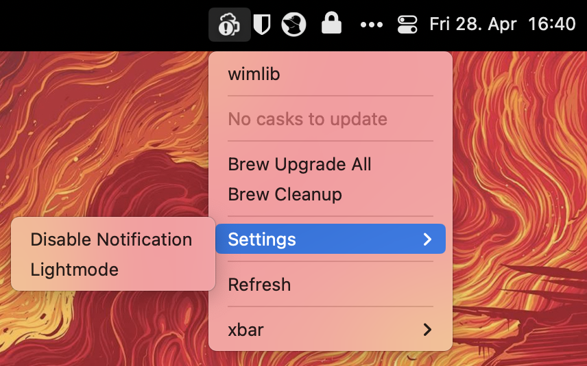

# xbar Homebrew Update

This [xbar](https://github.com/matryer/xbar) plugin let's you update `formulae` and `casks`.

## Install

Download the shell script:

```Shell
wget -qO- your_link_here | tar xvz -C "~/Library/Application Support/xbar/plugins/" --strip-components=1
ln -s ~/Library/Application Support/xbar/plugins/homebrew-update/homebrew-update.1h.sh ~/Library/Application Support/xbar/plugins/homebrew-update.1h.sh    
```

## Usage



If you click on a `formula` or `cask` a Terminal opens to upgrade the specific `formula` or `cask`. You can also click on `Upgrade All` to update all listed `formulae` and `casks`.


You can activate notifications and toggle dark / light mode for the icon.
