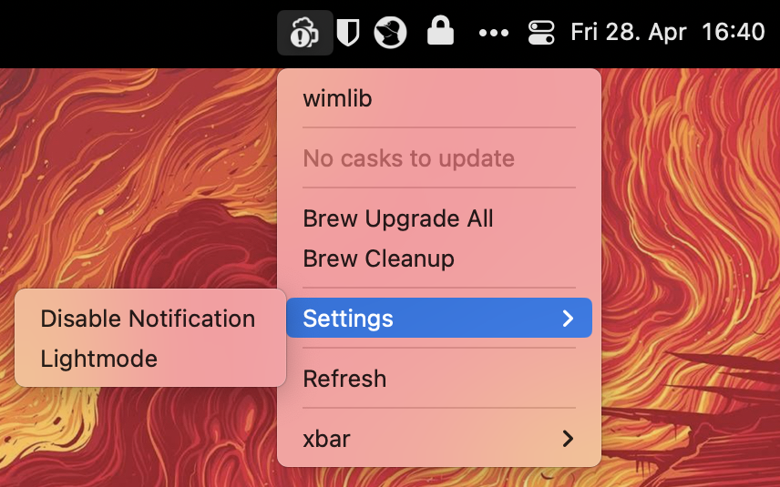

# xbar Homebrew Update

This [xbar](https://github.com/matryer/xbar) plugin let's you update `formulae` and `casks`.

## Install

Download and install the plugin:

```Shell
mkdir "~/Library/Application Support/xbar/plugins/homebrew-update"
wget -qO- https://github.com/mietzen/xbar-homebrew-update-plugin/archive/refs/heads/main.tar.gz | tar xvz -C "~/Library/Application Support/xbar/plugins/homebrew-update" --strip-components=1
ln -s "~/Library/Application Support/xbar/plugins/homebrew-update/homebrew-update.1h.sh" "~/Library/Application Support/xbar/plugins/homebrew-update.1h.sh"
```

## Usage



If you click on a `formula` or `cask` a Terminal opens to upgrade the specific `formula` or `cask`. You can also click on `Upgrade All` to update all listed `formulae` and `casks`.

