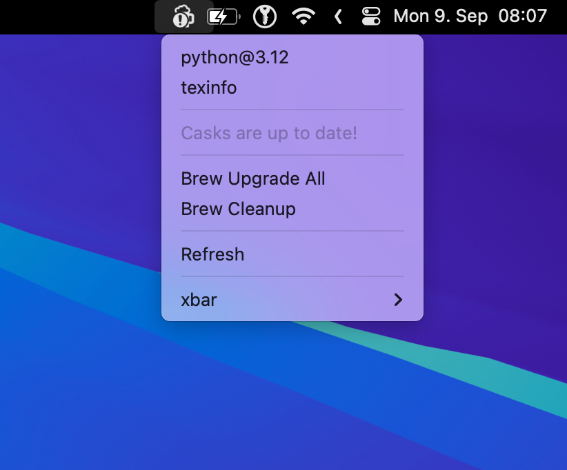

# xbar Homebrew Update

This [xbar](https://github.com/matryer/xbar) plugin let's you update `formulae` and `casks`.

## Install

Download and install the plugin:

```shell
mkdir "~/Library/Application Support/xbar/plugins/homebrew-update"
wget -qO- https://github.com/mietzen/xbar-homebrew-update-plugin/archive/refs/heads/main.tar.gz | tar xvz -C "~/Library/Application Support/xbar/plugins/homebrew-update" --strip-components=1
ln -s "~/Library/Application Support/xbar/plugins/homebrew-update/homebrew-update.1h.sh" "~/Library/Application Support/xbar/plugins/homebrew-update.1h.sh"
```

### Working with "sudo" casks

To make this work with `casks` that need `root` access to be installed, the easiest way is to enable `sudo` via touch-id:

```shell
cat << 'EOF' >> ~/.zshrc

# Enable touch-id for sudo
enable-sudo-touch-id() {
    if ! grep -c pam_tid.so /etc/pam.d/sudo &> /dev/null; then
        echo "Enable sudo via Touch ID"
        sudo cp /etc/pam.d/sudo /etc/pam.d/sudo.bak
        awk -v text="auth       sufficient     pam_tid.so" '!/^#/ && !p {print text; p=1} 1' /etc/pam.d/sudo | sudo tee /etc/pam.d/sudo &> /dev/null
    fi
}
enable-sudo-touch-id

EOF
exec zsh
enable-sudo-touch-id
```

## Usage



If you click on a `formula` or `cask` a Terminal opens to upgrade the specific `formula` or `cask`. You can also click on `Upgrade All` to update all listed `formulae` and `casks`.

